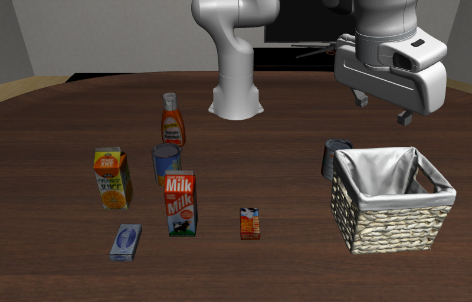
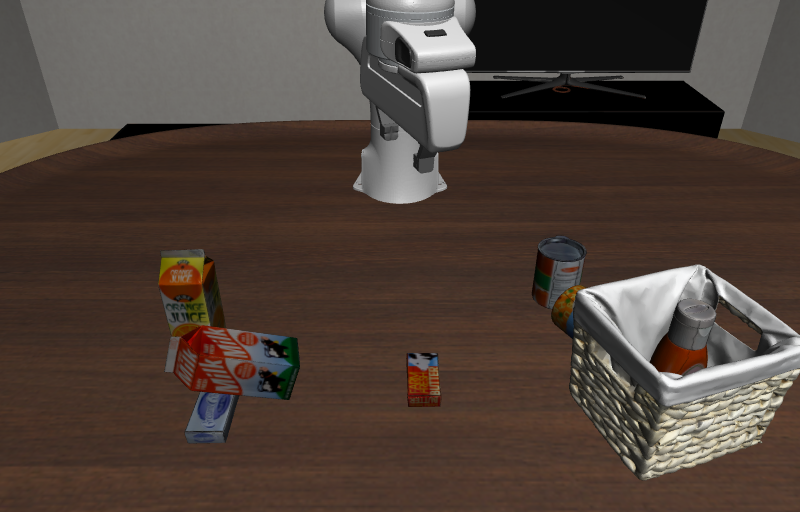

# CaP-X / CaP-Agent0：机器人代码闭环适配测试

## 结论

已在 LIBERO-PRO 的 LIBERO-10 任务 0、公开初态 40 上完成一条完整预算轨迹。原生多候选代码生成、执行、视觉变化反馈和重新生成流程均实际运行；不是模拟工具回复，也不是预写动作脚本。

**最终成功 0/1，曾经成功 0/1。** 前九段控制代码正常执行，第十段运行到环境物理预算上限停止。它证明部署链路已贯通，不证明该配置已具备可靠任务能力；单条轨迹不能估计总体成功率。

## 保留的架构与适配

- 源码固定为 `53e9966d7a8e2fa7494676772bccc35280f5c0ed`，使用原生 `_run_single_trial` 多轮循环。
- 使用仓库原生支持的九候选单模型集成与综合分支，保留不同采样温度；这不是论文的异构多模型集成。
- 保留技能库、Python 控制代码、执行反馈、主/腕相机反馈、视觉变化描述，以及 REGENERATE/FINISH 决策。
- 保留原生 JOINT_POSITION、PyRoKi 逆运动学、Contact-GraspNet 权重与候选抓取流程。CaP 不使用 Pi0.5 替代底层控制，因而不能当作固定 VLA 的严格公平对手。
- DeepSeek V4-Pro 生成代码并决策，Flash 转写图像。SAM3 接口换成 Grounding DINO-base + SAM2.1-large，保留文本定位、掩码与点提示分割接口。分数不解释为与 SAM3 等价。
- 生成代码可用数值运算、持久变量/函数和公开机器人 API；不能读取私有真值、API 密钥或任意文件。该数值执行边界不是完整的通用 Python 安全沙箱。

源码原有 Molmo 点定位服务没有部署；本次有效轨迹没有调用它。不能据此声称整个可选工具目录都已验证。实际使用的文本分割、点云、抓取和 IK 服务均有调用记录。

## 实验结果

| 项目 | 记录 |
|---|---|
| 任务 | 把 alphabet soup 和 tomato sauce 放入篮子；LIBERO-10 task 0 |
| 初态 / 种子 | 40 / 7；修复重复 reset 覆盖初态，保存稳定后哈希 |
| 环境预算 | 原生 8000 步，包含十步稳定过程；实际评分记录 7990 步 |
| 代码执行 | 10 段；前 9 段正常返回，第 10 段遇到环境预算终止 |
| 原生重新生成 / FINISH | 9 / 0 |
| 最终 / 曾经成功 | 0/1 / 0/1 |
| 模型请求 | 130 次成功：110 次决策/视觉变化描述请求，20 次图像转写 |
| API 费用 | 约 1.89591 美元，不含 GPU 与调试 |

逐步私有真值全部为失败；不是仅查看程序结束时的一个布尔值。原生 `task_completed`/`reward` 使用隐藏评分占位，不用于报告计分；原生决策提示只读代码输出、错误和视觉反馈。代码里的“Task complete”打印也不计为成功，且不等同于 Agent 最终选择 FINISH。

第十段的 `executing action in terminated episode` 是原生环境达到预设物理上限，不是缺包或接口未跑通。它按预算耗尽计为有效失败，不通过提高预算或人工完成任务来改成成功。

## 可核查的不足

1. **代码完成与任务完成脱节。** 第一段打印“两个物体均已放入篮子”，但其后图像显示篮子仍空，真值为失败。后续多段也打印完成而真值仍未成立。原生闭环没有直接相信这些打印并停止，而是继续重写；因此证据是局部代码后置条件薄弱，不是最终 FINISH 误报。
2. **重复定位与操作没有形成稳定进展。** 控制程序反复分割 soup、sauce 与 basket，重新计算目标点、选抓取、移动和放置。图像中出现目标仍在篮外、其他物品被带倒、篮子发生位移等现象。代码无异常不代表对象关系正确，也不代表前面完成的子目标被保护。
3. **语义与几何证据仍有歧义。** 分割经常返回多个候选；成功分割、较高抓取分数与机器人到达目标位姿均不能证明指定物体被正确抓住并留在容器中。最终代码开始检查夹爪开度并尝试其他抓取，但预算耗尽仍未完成。具体错误分别由掩码、目标身份、接触运动或生成代码贡献多少，尚无逐项干预证据。
4. **长执行下的局部重试成本。** 7990 个评分步、十段控制代码和 130 次模型请求仍未满足两个物体的组合条件。该轨迹支持研究“子目标后置条件、持久对象身份、证据更新与恢复预算”，但不能仅凭这一条证明长程记忆是主因，或证明增加上下文一定有效。

第一段执行后观察（原生 `visual_feedback_02.png`）：

后续观察（原生 `visual_feedback_06.png`）可见有物品进入篮子，但仍有物体在外，其他物品姿态也已改变；评分仍未通过：

## 修复与排除项

依赖/EGL、重置顺序、完整动作计数、九候选 HTTP 接收队列和 NumPy 内部 reduction 兼容问题已修复，详见 `ROBOTICS_AGENT_RUNTIME_ADAPTATIONS.md`。接口与数值边界 17 项回归测试通过。

有效轨迹为 `20260916-capx-task0-v4`。早期 canary 只检查安装与动作链路；task0-v1 漏计动作，v2 网络接收失败，v3 受数值执行边界缺陷污染，均不计入干净结果。v3 虽然也跑满预算并出现过短暂成功，不把它挑出来替代有效轨迹。相关 API 调试账本 v1、v2 分别约 0.56776、1.45557 美元，与有效实验费用分开。

## 记录位置与边界

摘要、逐段输出与费用：`results/20260915-open-agents/capx/summary.json`。数据盘原始实验目录为 `experiments/coding-agent/20260916-capx-task0-v4`，保留完整生成代码、候选、提示、实际关节动作、逐步私有真值及双视角视频。

这是一项机器人场景适配诊断，不是原论文全领域复现。与 RPent、Zetta、Thea port 的模型、动作类型、预算和任务数并不一致；不能直接排成同预算排行榜。后续统一比较需固定协议后重新评测，不能拿本轮不同配置的比例直接写成算法优势。
